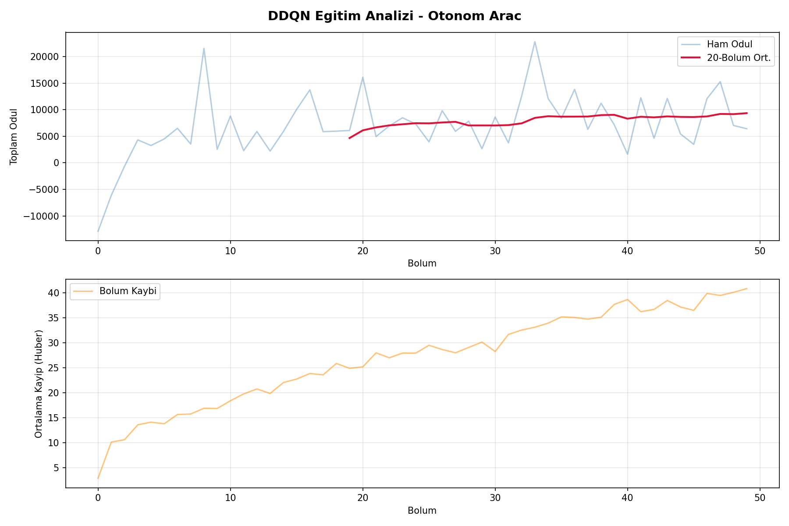

# Otonom Araç Simülasyonu 🚗🤖

Bu proje, **Pekiştirmeli Öğrenme (Reinforcement Learning)** algoritmalarını (PPO ve Dueling Double DQN) kullanarak 5 şeritli yoğun bir otoyolda güvenli ve otonom bir şekilde ilerleyebilen bir yapay zeka ajanı geliştirmeyi amaçlamaktadır.



## Özellikler

- **Gelişmiş Çevre Modeli (CarEnv):** Gymnasium ve Pygame tabanlı, 5 şeritli, dinamik trafik akışına sahip özel otoyol simülasyonu.
- **Güvenli Sürüş Odaklı:** Ajanın sadece hızlanmasını değil; takip mesafesini korumasını, gereksiz şerit değiştirmemesini ve kazalardan kaçınmasını sağlayan detaylı bir ödül (reward) mekanizması.
- **Sensör Sistemi:** Ajan, etrafındaki araçları algılamak için 9 yönlü sanal LiDAR sensörleri kullanır.
- **PPO ve DDQN Modelleri:** Projede hem Stable-Baselines3 kütüphanesinden PPO (Proximal Policy Optimization) hem de özel yazılmış Dueling Double DQN modelleri test edilmiştir.
- **Anti-Freeze (Donma Koruması):** Uzun süren eğitim süreçlerinde Pygame penceresinin çökmesini engelleyen asenkron olay dinleyici sistemi.

## Kurulum

Projeyi çalıştırmak için aşağıdaki Python kütüphanelerinin yüklü olması gerekmektedir:

```bash
pip install pygame gymnasium stable-baselines3[extra] numpy torch
```

## Kullanım

Projeyi başlatmak için ana dosyayı çalıştırın:

```bash
python main.py
```

Ekrana gelen menüden:
1. **AI Eğitimini Başlat:** Mevcut modeli eğitmek veya sıfırdan eğitim başlatmak için seçilir.
2. **AI İzle:** Eğitilmiş en son modelin (örn. `otonom_arac_beyni_v14`) trafikteki performansını izlemek için seçilir.
3. **Çıkış:** Simülasyondan çıkar.

## Proje Yapısı

- `main.py`: Eğitim ve izleme süreçlerini yöneten, menü tabanlı ana dosya (PPO modelini kullanır).
- `car_env.py`: Özel Gymnasium ortamı. Trafik akışını, araç fiziklerini, sensörleri ve çizim (render) işlemlerini barındırır.
- `ddqn_agent.py`: Dueling Double DQN algoritmasının implementasyonu.
- `egit.py`: DDQN modeli için eğitim döngülerini içeren alternatif eğitim dosyası.
- `deneme.py`: Test ve deneme fonksiyonları.
- `*.zip / *.pth`: Eğitilmiş model dosyaları.

## Teknolojiler

- Python 3.x
- Pygame
- Gymnasium (OpenAI Gym halefi)
- Stable-Baselines3
- PyTorch

## Lisans

Bu proje eğitim amaçlı geliştirilmiştir. İstediğiniz gibi kullanıp geliştirebilirsiniz.
